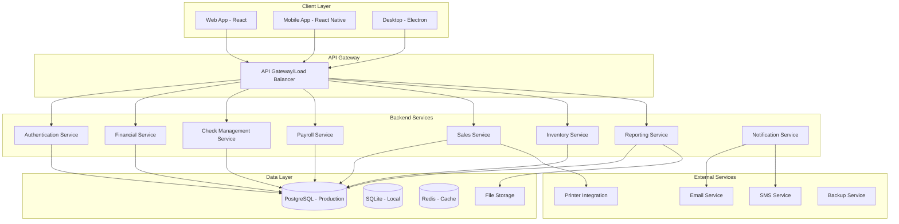

# Small Business Accounting System - Architecture Documentation

## 🏗️ System Architecture Overview

### Architecture Pattern: Microservices with Modular Monolith


## 🎯 Technology Stack

### Frontend
- **Web Application**: React 18 + TypeScript + Vite
- **Mobile Application**: React Native + TypeScript
- **Desktop**: Electron wrapper for web app
- **UI Framework**: Material-UI / Ant Design
- **State Management**: Redux Toolkit + RTK Query
- **Internationalization**: React-i18next (Persian + English)

### Backend
- **Runtime**: Node.js 18+
- **Framework**: Express.js + TypeScript
- **Database**: PostgreSQL (production) / SQLite (local development)
- **ORM**: Prisma
- **Authentication**: JWT + Refresh Tokens
- **File Upload**: Multer
- **PDF Generation**: PDFKit
- **Email**: Nodemailer
- **Caching**: Redis

### DevOps & Infrastructure
- **Containerization**: Docker + Docker Compose
- **Database Migration**: Prisma Migrate
- **API Documentation**: Swagger/OpenAPI
- **Testing**: Jest + Supertest + React Testing Library
- **CI/CD**: GitHub Actions
- **Monitoring**: Winston Logger

## 🔧 Core Modules

### 1. Authentication & Authorization Module
- User registration and login
- Role-based access control (Admin, Accountant, Viewer)
- JWT token management
- Password recovery
- Multi-factor authentication (optional)

### 2. Financial Management Module
- Daily income and expense tracking
- Expense categorization
- Financial reporting (monthly, yearly, custom)
- Budget planning and tracking
- Account reconciliation

### 3. Check & Installment Management Module
- Receivable and payable checks
- Due date reminders
- Check status tracking (pending, cleared, bounced)
- Installment payment schedules
- Automated notifications

### 4. Payroll Management Module
- Employee information management
- Salary calculation with benefits and deductions
- Payroll reports
- Tax calculations
- Attendance integration

### 5. Sales & Services Module
- Invoice generation
- Customer management
- Service tracking
- Sales reports
- Integration with inventory

### 6. Inventory Management Module
- Product and service catalog
- Real-time stock tracking
- Low stock alerts
- Popular/slow-moving item reports
- Supplier management

### 7. Reporting Module
- Financial statements
- Tax reports
- Custom report builder
- Export to PDF/Excel
- Dashboard analytics

### 8. Notification Module
- Email notifications
- SMS alerts
- In-app notifications
- Due date reminders
- System alerts

## 🗄️ Database Architecture

### Database Selection Strategy
- **Local Development**: SQLite for simplicity and portability
- **Production Web**: PostgreSQL for scalability and advanced features
- **Mobile Offline**: SQLite with sync capabilities

### Key Design Principles
- Normalized database design
- Audit trails for all financial transactions
- Soft deletes for data integrity
- Proper indexing for performance
- Foreign key constraints

## 🔒 Security Considerations

### Authentication & Authorization
- JWT with short expiration times
- Refresh token rotation
- Role-based permissions
- API rate limiting
- Session management

### Data Protection
- Input validation and sanitization
- SQL injection prevention (using ORM)
- XSS protection
- CSRF tokens
- Data encryption at rest

### Backup & Recovery
- Automated daily backups
- Point-in-time recovery
- Data export capabilities
- Disaster recovery procedures

## 📱 Cross-Platform Strategy

### Code Sharing
- Shared business logic through TypeScript libraries
- Common API interfaces
- Reusable UI components
- Synchronized data models

### Platform-Specific Features
- **Web**: Full feature set with desktop-class UI
- **Mobile**: Touch-optimized UI with offline capabilities
- **Desktop**: File system access and printer integration

## 🚀 Deployment Architecture

### Development Environment
```
Local Machine → SQLite → Node.js Development Server
```

### Production Environment
```
Load Balancer → App Servers → PostgreSQL Cluster → Redis Cache
```

### Mobile Deployment
```
App Stores (Google Play, Apple App Store) → Mobile App → API Gateway
```

## 📊 Performance Considerations

### Database Optimization
- Proper indexing strategy
- Query optimization
- Connection pooling
- Database partitioning for large datasets

### Caching Strategy
- Redis for session storage
- API response caching
- Static asset caching
- Database query result caching

### Scalability
- Horizontal scaling capability
- Microservices architecture
- API gateway for load distribution
- CDN for static assets

## 🔄 Data Flow Architecture

### Request Flow
1. Client sends request to API Gateway
2. Authentication middleware validates JWT
3. Request routed to appropriate service
4. Service processes business logic
5. Database operations through ORM
6. Response formatted and returned
7. Client updates UI state

### Real-time Features
- WebSocket connections for live updates
- Server-sent events for notifications
- Real-time dashboard updates
- Live inventory tracking

This architecture provides a solid foundation for a scalable, maintainable, and feature-rich accounting system that meets all your specified requirements.