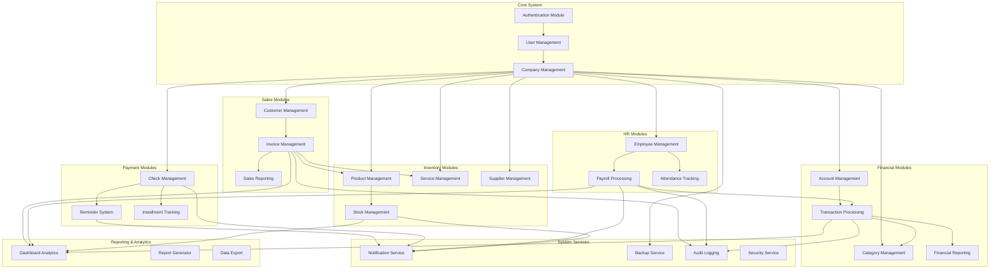

# Module Structure and Relationships

## 📋 System Module Overview



## 🏗️ Module Architecture Details

### 1. Authentication & Authorization Module

**Components:**
- `AuthController`: Handles login, registration, password reset
- `AuthMiddleware`: JWT validation and role-based access
- `UserService`: User management operations
- `PermissionService`: Role and permission management

**Dependencies:**
- JWT library for token management
- bcrypt for password hashing
- Redis for session storage (optional)

**Key Features:**
- User registration and login
- JWT token generation and validation
- Role-based access control (RBAC)
- Password recovery and reset
- Multi-factor authentication support

### 2. Financial Management Module

**Components:**
- `AccountController`: Account CRUD operations
- `TransactionController`: Transaction processing
- `CategoryController`: Category management
- `FinancialReportService`: Report generation

**Dependencies:**
- Prisma ORM for database operations
- Decimal.js for precise financial calculations
- Chart.js for financial visualization

**Key Features:**
- Multi-account management
- Double-entry bookkeeping
- Financial reporting (P&L, Balance Sheet)
- Budget tracking and analysis

### 3. Check & Installment Module

**Components:**
- `CheckController`: Check management
- `ReminderService`: Automated reminder system
- `InstallmentTracker`: Installment payment tracking

**Dependencies:**
- Notification service for reminders
- Scheduler for automated tasks
- Email/SMS services

**Key Features:**
- Check status tracking
- Due date management
- Automated reminders
- Installment schedules

### 4. Payroll Management Module

**Components:**
- `EmployeeController`: Employee management
- `PayrollController`: Salary processing
- `AttendanceService`: Time tracking
- `TaxCalculator`: Tax and deduction calculations

**Dependencies:**
- Financial module for transaction recording
- Notification service for payroll alerts
- Tax calculation libraries

**Key Features:**
- Employee information management
- Salary calculation with deductions
- Tax calculations
- Payroll reporting

### 5. Sales & Customer Module

**Components:**
- `CustomerController`: Customer management
- `InvoiceController`: Invoice processing
- `SalesReportService`: Sales analytics
- `PaymentTracker`: Payment tracking

**Dependencies:**
- Inventory module for stock updates
- Financial module for revenue recording
- PDF generation for invoices

**Key Features:**
- Customer relationship management
- Invoice generation and tracking
- Sales analytics and reporting
- Payment processing

### 6. Inventory Management Module

**Components:**
- `ProductController`: Product catalog
- `ServiceController`: Service management
- `StockController`: Inventory tracking
- `SupplierController`: Supplier management

**Dependencies:**
- Sales module for stock updates
- Notification service for low stock alerts
- Barcode scanning libraries (optional)

**Key Features:**
- Product and service catalog
- Real-time stock tracking
- Low stock alerts
- Supplier management

## 🔄 Data Flow Between Modules

### Transaction Flow
```
Sales → Create Invoice → Update Stock → Record Revenue Transaction → Generate Financial Reports
```

### Payroll Flow
```
Employee Data → Calculate Payroll → Record Expense Transaction → Generate Payroll Reports
```

### Check Management Flow
```
Create Check → Set Reminders → Send Notifications → Update Status → Record in Financials
```

### Inventory Flow
```
Receive Stock → Update Inventory → Check Low Stock → Send Alerts → Generate Reports
```

## 📊 Module Integration Matrix

| Module | Financial | Check | Payroll | Sales | Inventory | Reports |
|--------|-----------|-------|---------|-------|-----------|---------|
| **Financial** | ✅ Core | ✅ Records | ✅ Records | ✅ Records | ➖ None | ✅ Data |
| **Check** | ✅ Transactions | ✅ Core | ➖ None | ➖ None | ➖ None | ✅ Data |
| **Payroll** | ✅ Expenses | ➖ None | ✅ Core | ➖ None | ➖ None | ✅ Data |
| **Sales** | ✅ Revenue | ➖ None | ➖ None | ✅ Core | ✅ Stock | ✅ Data |
| **Inventory** | ➖ None | ➖ None | ➖ None | ✅ Products | ✅ Core | ✅ Data |
| **Reports** | ✅ Analytics | ✅ Analytics | ✅ Analytics | ✅ Analytics | ✅ Analytics | ✅ Core |

## 🛠️ Implementation Patterns

### 1. Repository Pattern
Each module uses repository pattern for data access:
```typescript
interface IUserRepository {
  findById(id: string): Promise<User>;
  create(user: CreateUserDto): Promise<User>;
  update(id: string, user: UpdateUserDto): Promise<User>;
  delete(id: string): Promise<void>;
}
```

### 2. Service Layer Pattern
Business logic is encapsulated in service classes:
```typescript
class PayrollService {
  constructor(
    private payrollRepo: IPayrollRepository,
    private financialService: FinancialService
  ) {}

  async processPayroll(employeeId: string): Promise<PayrollRecord> {
    // Calculate payroll
    // Record financial transaction
    // Send notifications
  }
}
```

### 3. Event-Driven Architecture
Modules communicate through events:
```typescript
// When invoice is created
eventBus.emit('invoice.created', { invoiceId, customerId, items });

// Inventory module listens and updates stock
eventBus.on('invoice.created', (data) => {
  inventoryService.updateStock(data.items);
});
```

### 4. Dependency Injection
Services are injected to ensure loose coupling:
```typescript
class InvoiceController {
  constructor(
    private invoiceService: InvoiceService,
    private inventoryService: InventoryService,
    private financialService: FinancialService
  ) {}
}
```

## 🔧 Module Configuration

### Environment-based Module Loading
```typescript
// Module configuration based on environment
const moduleConfig = {
  development: {
    enableAllModules: true,
    debugMode: true,
    logLevel: 'debug'
  },
  production: {
    enableAllModules: true,
    debugMode: false,
    logLevel: 'info'
  },
  lite: {
    // Lite version with limited modules
    enabledModules: ['auth', 'financial', 'basic-reporting'],
    debugMode: false,
    logLevel: 'warn'
  }
};
```

### Feature Flags
```typescript
// Feature flags for gradual rollout
const featureFlags = {
  ADVANCED_REPORTING: true,
  MULTI_CURRENCY: false,
  INVENTORY_BARCODE: false,
  MOBILE_APP: true,
  API_RATE_LIMITING: true
};
```

This modular architecture ensures scalability, maintainability, and allows for easy feature additions or modifications without affecting the entire system.